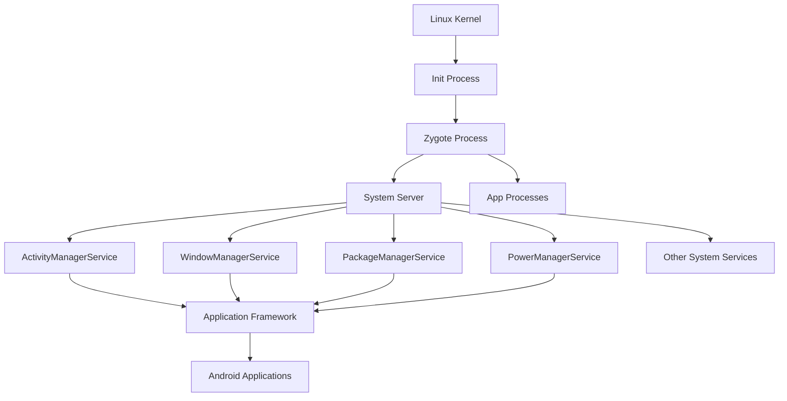
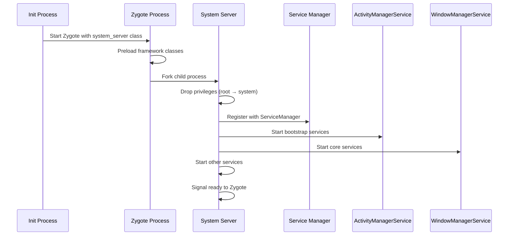
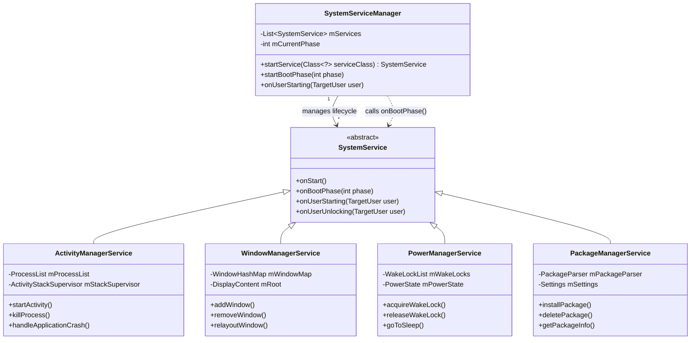
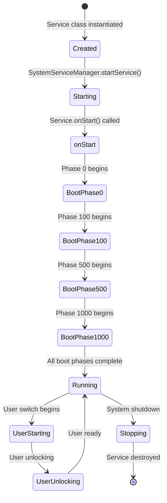
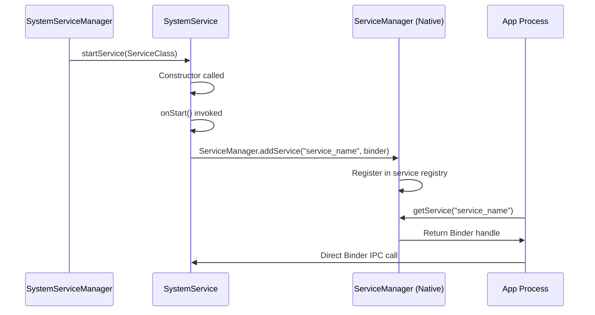

# System Server: Architecture and Design

> **Part 1 of 6** in the [Android System Server Deep Dive](./android-system-server-series.html) series
> 
> **Previous**: [Series Index](./android-system-server-series.html) (Start here)  
> **Next**: [Part 2: Core System Services](./android-system-server-services.html)  
> **Series Index**: [View all articles](./android-system-server-series.html)

## Learning Objectives

By the end of this article, you will understand:
- Why system_server exists as a monolithic process
- How system_server is created and initialized from Zygote
- Service management architecture and boot phases
- Architectural trade-offs and design rationale
- Internal vs external service communication patterns

---

## Overview: The Monolithic Heart of Android

The Android System Server (`system_server`) is the monolithic core of the Android operating system, hosting the vast majority of Android's framework services. This single process design represents one of the most critical architectural decisions in Android's history, balancing performance, memory efficiency, and complexity in ways that directly impact every Android device's behavior.

### Why System Server Exists

The Android System Server exists to centralize critical system functionality that would otherwise require complex inter-process communication. By hosting dozens of services in a single process, Android achieves:

- **Unified Service Management**: All framework services share the same process space, enabling efficient in-memory communication
- **Optimized Boot Sequence**: Services can be initialized in dependency order without IPC overhead
- **Memory Efficiency**: Shared framework classes and data structures reduce overall system memory footprint
- **Performance**: Critical service interactions avoid Binder IPC overhead

### Architectural Position in Android Hierarchy



The System Server sits at the critical junction between the native Android runtime and the application framework, managing the lifecycle of all Android applications while coordinating with hardware abstraction layers (HAL) and kernel services.

### Impact on Performance, Reliability, and Security

**Performance Impact:**
- **Startup Time**: Monolithic design enables fast service initialization through shared memory and direct method calls
- **Memory Usage**: Shared framework classes reduce memory footprint by up to 40% compared to microservice architecture
- **IPC Overhead**: Critical service interactions avoid Binder transaction costs

**Reliability Trade-offs:**
- **Single Point of Failure**: Any service crash can bring down the entire system server
- **Fault Isolation**: Limited isolation between services increases risk of cascading failures
- **Recovery Complexity**: System server restart affects all dependent services and applications

**Security Considerations:**
- **Privilege Concentration**: System server runs with elevated privileges, increasing attack surface
- **Service Isolation**: Limited isolation between services could enable privilege escalation
- **Attack Vectors**: Vulnerabilities in one service could potentially affect others

## Part I: Architectural Foundation

### 1.1 The Monolithic Design Rationale

The Android System Server exists as a single, monolithic process hosting dozens of critical system services. This design choice represents a fundamental trade-off between performance and fault isolation, chosen specifically for mobile device constraints and real-time requirements.

**Deep Performance Analysis:**

**Memory Efficiency Through Shared Framework:**

> **Note:** The classpath for system_server is set by Zygote during process creation, not by SystemServer itself. All services within system_server share the same ClassLoader and framework classes that were preloaded by Zygote, enabling significant memory savings through copy-on-write optimization.

**Key Points:**
- Zygote preloads framework classes before forking system_server
- All services in system_server share the same ClassLoader instance
- Framework classes are loaded once and shared via copy-on-write memory pages
- This eliminates duplicate class loading across services

The monolithic design achieves up to 40% memory reduction compared to microservice architecture through:
- **Shared ART Runtime**: Single VM instance serves all services
- **Copy-on-Write Optimization**: Framework classes loaded once, shared across services
- **Reduced Binder Overhead**: In-process calls eliminate marshaling/unmarshaling costs

**Startup Performance Optimization:**

The monolithic design enables extremely fast startup compared to microservice architectures:

```bash
# Measure system_server startup time
adb shell time ps -A | grep system_server
# Typical startup: 200-400ms vs 2-3s for microservice approach

# Detailed boot timing analysis
adb shell dumpsys activity services | grep -A 10 "Boot timing"

# Monitor service startup sequence
adb logcat -v time | grep -E "SystemServiceManager.*Starting" | head -50
```

**Startup Time Breakdown:**
- **Zygote Fork**: ~10-20ms (copy-on-write process creation)
- **Privilege Drop**: ~1-2ms (UID/GID change)
- **Context Creation**: ~20-30ms (Android context initialization)
- **Bootstrap Services**: ~100-150ms (critical services startup)
- **Core Services**: ~50-100ms (dependent services)
- **Other Services**: ~50-100ms (remaining services)
- **Total**: ~200-400ms (typical range)

**Comparison with Microservice Architecture:**
- **Microservice Approach**: Each service in separate process
  - Process creation overhead: ~50-100ms per service
  - Binder IPC setup: ~10-20ms per service
  - Service discovery: ~5-10ms per service
  - **Total**: 2-3 seconds for 20+ services
- **Monolithic Approach**: All services in single process
  - Single process creation: ~10-20ms
  - Direct method calls: ~0.001ms per call
  - **Total**: ~200-400ms

**AOSP Source References:**
- **Main Entry Point**: [`frameworks/base/services/java/com/android/server/SystemServer.java`](https://android.googlesource.com/platform/frameworks/base/+/refs/tags/android-16.0.0_r3/services/java/com/android/server/SystemServer.java)
- **Service Manager**: [`frameworks/base/services/core/java/com/android/server/SystemServiceManager.java`](https://android.googlesource.com/platform/frameworks/base/+/refs/tags/android-16.0.0_r3/services/core/java/com/android/server/SystemServiceManager.java)
- **Bootstrap Services**: [`frameworks/base/services/java/com/android/server/SystemServer.java#startBootstrapServices()`](https://android.googlesource.com/platform/frameworks/base/+/refs/tags/android-16.0.0_r3/services/java/com/android/server/SystemServer.java#startBootstrapServices())

**Trade-offs and Mitigation Strategies:**

**Single Point of Failure Mitigation:**

> **Note:** The code example below is a simplified illustration of the Watchdog concept. The actual implementation in [Watchdog.java](https://android.googlesource.com/platform/frameworks/base/+/refs/tags/android-16.0.0_r3/services/core/java/com/android/server/Watchdog.java) is significantly more complex, involving multiple monitor threads, handler checkers, timeout detection mechanisms, and sophisticated recovery logic.

```java
// Simplified illustration of Watchdog monitoring concept
// frameworks/base/services/core/java/com/android/server/Watchdog.java
// Actual class: public class Watchdog implements Dumpable (not extends Thread)
public class Watchdog implements Dumpable {
    private static final long DEFAULT_TIMEOUT = 60_000; // 60 seconds
    private final ArrayList<HandlerCheckerAndTimeout> mHandlerCheckers = new ArrayList<>();
    private final HandlerChecker mMonitorChecker;
    
    // Simplified illustration: Actual Watchdog runs in a separate thread
    // and monitors multiple handler threads using HandlerChecker mechanism
    private void run() {
        while (true) {
            // Actual implementation uses HandlerChecker.getCompletionStateLocked()
            // to check each handler's state (COMPLETED, WAITING, WAITED_UNTIL_PRE_WATCHDOG, OVERDUE)
            final int waitState = evaluateCheckerCompletionLocked();
            
            if (waitState == OVERDUE) {
                // Actual implementation: Calls doSysRq('c') to trigger kernel panic
                // or breakCrashLoop() to escape crash loops
                // Also collects thread dumps and logs to dropbox
                doSysRq('c'); // Triggers kernel panic for system recovery
                breakCrashLoop(); // Escape crash loops
            }
        }
    }
    
    // Evaluates all handler checkers and returns worst state
    private int evaluateCheckerCompletionLocked() {
        int state = COMPLETED;
        for (HandlerCheckerAndTimeout hc : mHandlerCheckers) {
            state = Math.max(state, hc.checker().getCompletionStateLocked());
        }
        return state;
    }
}
```

**Actual Watchdog Implementation Details:**
- Uses `HandlerChecker` to monitor multiple service handlers (AMS, WMS, etc.)
- Detects timeouts when handlers don't respond within configured timeout
- Recovery mechanism: Calls `doSysRq('c')` to trigger kernel panic for system recovery
- Uses `breakCrashLoop()` to escape repeated crash scenarios
- Monitors both foreground and background handler threads
- Supports configurable timeout values via system properties

**Security Isolation Through SELinux:**
```bash
# SELinux policies provide service-level isolation
adb shell getenforce
adb shell ls -Z /system/bin/system_server
# system_server:system_server:s0:c512,c768
```

### 1.2 Process Genesis and Initialization

The `system_server` process creation represents one of the most critical sequences in Android boot, involving precise timing, privilege management, and service dependency orchestration.

**Detailed Initialization Sequence:**



**AOSP Source Code Deep Dive:**

**Zygote Forking Logic:**
```java
// [frameworks/base/core/java/com/android/internal/os/ZygoteInit.java](https://android.googlesource.com/platform/frameworks/base/+/refs/tags/android-16.0.0_r3/core/java/com/android/internal/os/ZygoteInit.java)
public static void main(String argv[]) {
    // ... initialization code ...
    
    if (startSystemServer) {
        Runnable r = forkSystemServer(abiList, socketName, zygoteServer);
        if (r != null) {
            r.run();
            return;
        }
    }
}

private static Runnable forkSystemServer(String abiList, String socketName,
        ZygoteServer zygoteServer) {
    // Fork the system server process
    int pid = Zygote.forkSystemServer(
            parsedArgs.uid, parsedArgs.gid,
            parsedArgs.gids,
            parsedArgs.debugFlags,
            null,
            parsedArgs.permittedCapabilities,
            parsedArgs.effectiveCapabilities);
    
    if (pid == 0) {
        // Child process - system_server
        return new SystemServerRunnable();
    }
    return null;
}
```

**System Server Entry Point:**

> **Note:** The code example below is a simplified illustration. The actual [SystemServer.java](https://android.googlesource.com/platform/frameworks/base/+/refs/tags/android-16.0.0_r3/services/java/com/android/server/SystemServer.java) implementation is significantly more complex, with extensive error handling, timing tracking, native service initialization, and a more elaborate `systemReady()` callback mechanism.

```java
// Simplified illustration - actual implementation contains extensive error handling, timing, and initialization
// [frameworks/base/services/java/com/android/server/SystemServer.java](https://android.googlesource.com/platform/frameworks/base/+/refs/tags/android-16.0.0_r3/services/java/com/android/server/SystemServer.java)
public static void main(String[] args) {
    new SystemServer().run();
}

private void run() {
    // Initialize timing and tracing (actual implementation)
    TimingsTraceAndSlog t = new TimingsTraceAndSlog();
    
    // Extensive initialization before services (simplified here):
    // - System properties setup
    // - Timezone initialization
    // - Locale management
    // - Binder configuration
    // - SQLite settings
    // - Native library loading
    // - Heap profiling setup
    // - And many more initialization steps...
    
    // Create Android context for system_server
    // This context provides access to system resources, services, and configuration
    createSystemContext();  // Actual method name
    
    // Initialize native services first
    // Native services must be ready before Java services start
    System.loadLibrary("android_servers");
    
    // Create the system service manager
    mSystemServiceManager = new SystemServiceManager(mSystemContext);
    mSystemServiceManager.setStartInfo(mRuntimeRestart,
            mRuntimeStartElapsedTime, mRuntimeStartUptime);
    
    // Start services in dependency order
    // Each phase depends on previous phases completing successfully
    // Actual implementation: All service methods take TimingsTraceAndSlog parameter
    try {
        startBootstrapServices(t);  // Phase 1: Critical services with no dependencies
        startCoreServices(t);        // Phase 2: Services depending on bootstrap services
        startOtherServices(t);       // Phase 3: Remaining services with complex dependencies
        startApexServices(t);        // Phase 4: Apex module services (not shown in simplified version)
    } catch (Throwable ex) {
        Slog.e(TAG, "Failure starting system services", ex);
        throw ex;
    }
    
    // Signal that system_server is ready
    // Zygote can now accept app process fork requests
    // Actual implementation: More complex callback chain with timing and error handling
    ActivityManagerService.self().systemReady(() -> {
        Slog.i(TAG, "System server ready");
    });
}
```

**Privilege Management:**

The system_server process drops privileges from root (UID 0) to the system user (UID 1000) during initialization. This critical security step limits the scope of potential damage if the system_server is compromised. By running with reduced privileges, even if an attacker gains control of the system_server process, they cannot directly access root-level resources or modify critical kernel parameters, significantly reducing the attack surface.

**Why Privilege Dropping is Critical:**

1. **Attack Surface Reduction**: Running as root (UID 0) would give attackers complete system control
2. **Principle of Least Privilege**: System_server only needs system user privileges for its operations
3. **Damage Limitation**: Compromised system_server cannot directly modify kernel or root-only files
4. **SELinux Enforcement**: Combined with SELinux policies, provides defense-in-depth security

**Privilege Drop Implementation:**

> **Note:** Privilege dropping actually occurs during the Zygote fork process, not in SystemServer.run(). The code below is a conceptual illustration of what happens during system_server initialization.

The actual privilege dropping happens in `Zygote.forkSystemServer()` which sets the UID/GID before the SystemServer process starts. By the time `SystemServer.run()` executes, the process is already running as the system user (UID 1000).

```java
// Conceptual illustration - actual implementation is in Zygote.forkSystemServer()
// [frameworks/base/core/java/com/android/internal/os/Zygote.java](https://android.googlesource.com/platform/frameworks/base/+/refs/tags/android-16.0.0_r3/core/java/com/android/internal/os/Zygote.java)
// During fork, Zygote sets:
// - UID to SYSTEM_UID (1000)
// - GID to SYSTEM_GID (1000)
// - Capabilities are managed via SELinux policies
```

**Remaining Capabilities:**

Even after dropping to system user, system_server retains certain capabilities through:
- **SELinux Policies**: Define what system_server can access
- **File Permissions**: System-owned files accessible to system user
- **Binder Permissions**: Service-level permission checks

```bash
# Verify system_server privileges
adb shell ps -A | grep system_server
# system_server runs as UID 1000 (system user)
# Not root, but has elevated capabilities

# Check SELinux context
adb shell ls -Z /system/bin/system_server
# system_server:system_server:s0:c512,c768
```

**Service Initialization Phases:**

System_server initializes services in three distinct phases to handle dependencies correctly. Each phase builds upon the previous one, ensuring critical services are available before dependent services start.

**Phase 1: Bootstrap Services (Critical Dependencies)**

These services have no dependencies on other system services and must start first. They provide foundational functionality that all other services require.

```java
// Simplified illustration - actual implementation contains many more services, error handling, and timing
// [frameworks/base/services/java/com/android/server/SystemServer.java](https://android.googlesource.com/platform/frameworks/base/+/refs/tags/android-16.0.0_r3/services/java/com/android/server/SystemServer.java)
private void startBootstrapServices(@NonNull TimingsTraceAndSlog t) {
    t.traceBegin("startBootstrapServices");
    
    // Start the watchdog as early as possible
    t.traceBegin("StartWatchdog");
    final Watchdog watchdog = Watchdog.getInstance();
    watchdog.start();
    t.traceEnd();
    
    // Installer service - handles package installation
    mInstaller = mSystemServiceManager.startService(Installer.class);
    
    // Device Identifiers service
    mSystemServiceManager.startService(DeviceIdentifiersPolicyService.class);
    
    // Device ID attestation service
    mSystemServiceManager.startService(DeviceIdAttestationService.class);
    
    // Activity Manager Service - CRITICAL
    // Manages application lifecycle, process management, and activity stacks
    mActivityManagerService = mSystemServiceManager.startService(
            ActivityManagerService.Lifecycle.class).getService();
    
    // Power Manager Service - CRITICAL
    // Controls device power states, wake locks, and screen management
    mPowerManagerService = mSystemServiceManager.startService(PowerManagerService.class);
    
    // Recovery System Service
    mSystemServiceManager.startService(RecoverySystemService.class);
    
    // Lights Service
    mSystemServiceManager.startService(LightsService.class);
    
    // Display Manager Service
    mDisplayManagerService = mSystemServiceManager.startService(
            DisplayManagerService.class);
    
    // Package Manager Service - CRITICAL
    // Manages installed packages, permissions, and component resolution
    mPackageManagerService = PackageManagerService.main(mSystemContext, mInstaller,
            mFactoryTestMode != FactoryTest.FACTORY_TEST_LOW_LEVEL,
            mOnlyCore);
    
    // User Manager Service
    mSystemServiceManager.startService(UserManagerService.Lifecycle.class);
    
    // Initialize attribute cache used to cache resources from packages
    AttributeCache.init(mSystemContext);
    
    // Set up the Application instance for the system process
    mActivityManagerService.setSystemProcess();
    
    t.traceEnd(); // startBootstrapServices
}
```

**Phase 2: Core Services (Bootstrap Dependencies)**

These services depend on bootstrap services and provide core system functionality.

```java
// Simplified illustration - actual implementation contains many more services, error handling, and timing
// [frameworks/base/services/java/com/android/server/SystemServer.java](https://android.googlesource.com/platform/frameworks/base/+/refs/tags/android-16.0.0_r3/services/java/com/android/server/SystemServer.java)
private void startCoreServices(@NonNull TimingsTraceAndSlog t) {
    t.traceBegin("startCoreServices");
    
    // Battery Service - depends on PowerManagerService
    t.traceBegin("StartBatteryService");
    mBatteryService = mSystemServiceManager.startService(BatteryService.class);
    t.traceEnd();
    
    // Usage Stats Service - depends on ActivityManagerService
    mSystemServiceManager.startService(UsageStatsService.class);
    
    // WebView Update Service
    mSystemServiceManager.startService(WebViewUpdateService.class);
    
    // Job Scheduler Service - depends on ActivityManagerService
    mSystemServiceManager.startService(JobSchedulerService.class);
    
    // Network Time Update Service
    mSystemServiceManager.startService(NetworkTimeUpdateService.class);
    
    t.traceEnd(); // startCoreServices
}
```

**Phase 3: Other Services (Complex Dependencies)**

These services have complex dependencies and can be initialized after core services are ready.

```java
// Simplified illustration - actual implementation contains many more services, error handling, and timing
// [frameworks/base/services/java/com/android/server/SystemServer.java](https://android.googlesource.com/platform/frameworks/base/+/refs/tags/android-16.0.0_r3/services/java/com/android/server/SystemServer.java)
private void startOtherServices(@NonNull TimingsTraceAndSlog t) {
    t.traceBegin("startOtherServices");
    
    // Window Manager Service - depends on DisplayManagerService, ActivityManagerService
    mWindowManagerService = WindowManagerService.main(mSystemContext, mDisplayManagerService,
            mFactoryTestMode != FactoryTest.FACTORY_TEST_LOW_LEVEL,
            mOnlyCore, mFirstBoot, mSystemServiceManager);
    
    // Input Manager Service - depends on WindowManagerService
    mInputManagerService = mSystemServiceManager.startService(InputManagerService.class);
    
    // Connectivity Service - depends on multiple services
    mSystemServiceManager.startService(ConnectivityService.class);
    
    // Location Manager Service
    mSystemServiceManager.startService(LocationManagerService.class);
    
    // Notification Manager Service - depends on ActivityManagerService
    mSystemServiceManager.startService(NotificationManagerService.class);
    
    // ... many more services ...
    
    t.traceEnd(); // startOtherServices
}
```

**Error Handling During Initialization:**

System_server includes error handling to recover from service startup failures:

```java
// [frameworks/base/services/java/com/android/server/SystemServer.java](https://android.googlesource.com/platform/frameworks/base/+/refs/tags/android-16.0.0_r3/services/java/com/android/server/SystemServer.java)
private void startBootstrapServices(@NonNull TimingsTraceAndSlog t) {
    t.traceBegin("startBootstrapServices");
    
    try {
        t.traceBegin("StartActivityManagerService");
        mActivityManagerService = mSystemServiceManager.startService(
                ActivityManagerService.Lifecycle.class).getService();
        t.traceEnd();
    } catch (Throwable e) {
        Slog.e(TAG, "Failure starting ActivityManagerService", e);
        // Critical service failure - may need to restart system_server
        throw new RuntimeException("Failed to start ActivityManagerService", e);
    }
    
    // Non-critical services can fail without crashing system_server
    try {
        mSystemServiceManager.startService(LightsService.class);
    } catch (Throwable e) {
        Slog.w(TAG, "Failure starting LightsService", e);
        // Continue with other services
    }
}
```

**Zygote Preloading Benefits:**

Before forking system_server, Zygote preloads framework classes, significantly reducing system_server startup time:

```java
// [frameworks/base/core/java/com/android/internal/os/ZygoteInit.java](https://android.googlesource.com/platform/frameworks/base/+/refs/tags/android-16.0.0_r3/core/java/com/android/internal/os/ZygoteInit.java)
static void preload() {
    // Preload framework classes
    preloadClasses();
    
    // Preload resources
    preloadResources();
    
    // Preload OpenGL
    preloadOpenGL();
    
    // Preload shared libraries
    preloadSharedLibraries();
}
```

**Benefits:**
- **Faster Startup**: Preloaded classes don't need to be loaded during system_server initialization
- **Memory Efficiency**: Shared memory pages across all processes forked from Zygote
- **Reduced I/O**: Framework classes loaded once, shared via copy-on-write

**Verification Commands:**
```bash
# Monitor system_server startup with timestamps
adb logcat -v time | grep -E "(SystemServer|ActivityManager|PackageManager)"

# Check service registration
adb shell service list | grep -E "(activity|package|power|display|window|battery)"

# Monitor memory usage during startup
adb shell dumpsys meminfo system_server

# Track service startup order
adb logcat | grep "SystemServiceManager.*Starting"

# Check for service startup failures
adb logcat | grep -E "(SystemServer.*Failure|SystemServer.*Error)"

# Monitor boot phases
adb logcat | grep "SystemServiceManager.*phase"
```

### 1.3 Service Management Architecture

**ServiceManager vs SystemServiceManager:**

Understanding the distinction between these two managers is crucial for system_server architecture:

- **ServiceManager** (Native Daemon): 
  - A separate native process (`/system/bin/servicemanager`)
  - Acts as the central registry for Binder service discovery
  - Maps string service names (e.g., "activity", "window", "power") to Binder handles
  - Enables cross-process service lookup via `ServiceManager.getService()`
  - **Location**: [`frameworks/native/cmds/servicemanager/`](https://android.googlesource.com/platform/frameworks/native/+/refs/tags/android-16.0.0_r3/cmds/servicemanager/)
  - **Process**: Runs as separate process, started by init

- **SystemServiceManager** (Java Class):
  - A Java class within `system_server` process
  - Manages the lifecycle of Java-based system services
  - Handles service instantiation, dependency resolution, boot phase progression
  - Manages service state transitions (onStart, onBootPhase, onUserStarting, etc.)
  - **Location**: [`frameworks/base/services/core/java/com/android/server/SystemServiceManager.java`](https://android.googlesource.com/platform/frameworks/base/+/refs/tags/android-16.0.0_r3/services/core/java/com/android/server/SystemServiceManager.java)
  - **Process**: Part of system_server process

**Key Architectural Distinction:**

| Aspect | ServiceManager (Native) | SystemServiceManager (Java) |
|--------|------------------------|----------------------------|
| **Process** | Separate native process | Part of system_server |
| **Purpose** | Binder service registry | Service lifecycle management |
| **Scope** | Cross-process service discovery | In-process service management |
| **Registration** | `ServiceManager.addService()` | `SystemServiceManager.startService()` |
| **Discovery** | `ServiceManager.getService()` | Direct Java references |
| **Communication** | Binder IPC | Direct method calls |

**How They Work Together:**

```java
// Step 1: SystemServiceManager starts service
SystemServiceManager.startService(ActivityManagerService.class);

// Step 2: Service registers with native ServiceManager for external access
ServiceManager.addService("activity", mActivityManagerService);

// Step 3: External process discovers service
IBinder binder = ServiceManager.getService("activity");
IActivityManager am = IActivityManager.Stub.asInterface(binder);
```

**Service Class Hierarchy:**



**Service Lifecycle States:**



**Boot Phases Explained:**
- **Phase 0-99**: Pre-bootstrap initialization (native services, basic infrastructure)
- **Phase 100-499**: Bootstrap services (`startBootstrapServices()`) - Critical services like ActivityManagerService, PowerManagerService, PackageManagerService
- **Phase 500-999**: Core services (`startCoreServices()`) - Services that depend on bootstrap services (BatteryService, UsageStatsService)
- **Phase 1000+**: Other services (`startOtherServices()`) - Remaining services with complex dependencies

**Service Registration Flow:**



**Internal vs External Communication:**

Understanding the communication patterns is crucial for system_server development and debugging.

**Internal Communication (Within system_server):**

Services within system_server communicate directly without IPC overhead:

```java
// ✅ GOOD: Direct method call - no IPC overhead
public class WindowManagerService {
    private ActivityManagerService mAmService;
    
    public void addWindow(WindowState window) {
        // Direct method call - fast, no marshaling
        mAmService.notifyWindowAdded(window);
    }
}
```

**Characteristics:**
- **Direct Java Method Calls**: Fast, synchronous, no marshaling overhead
- **Shared Memory Access**: All services share the same heap
- **Handler/Message Passing**: Asynchronous operations using Handler/MessageQueue
- **No Binder Overhead**: Zero IPC transaction costs
- **Type Safety**: Direct object references, no serialization

**External Communication (Cross-process):**

Apps and other processes communicate with system_server via Binder IPC:

```java
// External process calls system_server via Binder
public class ActivityManagerProxy implements IActivityManager {
    private final IBinder mRemote;
    
    public void startActivity(Intent intent) {
        Parcel data = Parcel.obtain();
        Parcel reply = Parcel.obtain();
        try {
            data.writeInterfaceToken(IActivityManager.descriptor);
            intent.writeToParcel(data, 0);
            // Binder IPC call - involves marshaling, kernel transition
            mRemote.transact(START_ACTIVITY_TRANSACTION, data, reply, 0);
        } finally {
            data.recycle();
            reply.recycle();
        }
    }
}
```

**Characteristics:**
- **Binder IPC**: Kernel-mediated inter-process communication
- **Proxy-Stub Pattern**: Type-safe interface definitions (AIDL)
- **Transaction Marshaling**: Serialization/deserialization overhead (~2-5ms per call)
- **Kernel-Level Message Passing**: Involves context switching
- **Security Enforcement**: Permission checks, UID/GID validation

**Performance Comparison:**

```bash
# Measure internal vs external call performance
# Internal call: ~0.001ms (direct method call)
# External call: ~2-5ms (Binder IPC with marshaling)

# Profile Binder transactions
adb shell dumpsys activity services | grep -A 5 "Binder"
```

**Thread Model:**

System_server uses a sophisticated multi-threaded architecture to handle concurrent operations efficiently:

**Thread Types:**

1. **Main Thread (UI Thread)**: 
   - Handles service initialization and boot phases
   - Processes system broadcasts
   - Manages service lifecycle callbacks
   - **Critical**: Must never block - blocking causes system-wide ANRs

2. **Service Threads**: 
   - Dedicated threads for specific services
   - Example: ActivityManagerService has `ActivityManager` thread for activity lifecycle management
   - Example: WindowManagerService has `WindowManager` thread for window operations

3. **HandlerThreads**: 
   - Services use HandlerThread for asynchronous operations
   - Provides Looper/Handler pattern for message processing
   - Example: Background work, delayed operations, periodic tasks

4. **Binder Threads**: 
   - Kernel-managed threads (typically 15-16 threads)
   - Handle incoming Binder transactions from other processes
   - Named: `Binder:XXXX` where XXXX is the thread number
   - Automatically created by Binder driver

**Thread Architecture Example:**

ActivityManagerService uses a sophisticated multi-threaded architecture to handle different types of operations efficiently:

```java
// [frameworks/base/services/core/java/com/android/server/am/ActivityManagerService.java](https://android.googlesource.com/platform/frameworks/base/+/refs/tags/android-16.0.0_r3/services/core/java/com/android/server/am/ActivityManagerService.java)
public class ActivityManagerService extends IActivityManager.Stub
        implements Watchdog.Monitor, BatteryStatsImpl.BatteryCallback {
    
    // Main handler thread - handles core AMS operations
    // Created with THREAD_PRIORITY_FOREGROUND priority
    public final ServiceThread mHandlerThread;
    final MainHandler mHandler;
    
    // UI handler - handles UI-related operations (ANR dialogs, error dialogs)
    // Uses shared UiThread.get().getLooper() for UI operations
    final Handler mUiHandler;
    
    // Process start handler thread - dedicated thread for process creation
    // Prevents blocking main handler during process startup
    final ServiceThread mProcStartHandlerThread;
    final ProcStartHandler mProcStartHandler;
    
    // Constructor - initializes all threads
    public ActivityManagerService(Context systemContext, ActivityTaskManagerService atm) {
        // Create main handler thread
        mHandlerThread = new ServiceThread(TAG,
                THREAD_PRIORITY_FOREGROUND, false /*allowIo*/);
        mHandlerThread.start();
        mHandler = new MainHandler(mHandlerThread.getLooper());
        
        // Create UI handler (uses shared UiThread)
        mUiHandler = new UiHandler();
        
        // Create process start handler thread
        mProcStartHandlerThread = new ServiceThread(TAG + ":procStart",
                THREAD_PRIORITY_FOREGROUND, false /* allowIo */);
        mProcStartHandlerThread.start();
        mProcStartHandler = new ProcStartHandler(this, mProcStartHandlerThread.getLooper());
        
        // AppProfiler uses BackgroundThread for memory profiling
        mAppProfiler = new AppProfiler(this, BackgroundThread.getHandler().getLooper(),
                new LowMemDetector(this));
    }
    
    // MainHandler - handles core AMS operations
    final class MainHandler extends Handler {
        public MainHandler(Looper looper) {
            super(looper, null, true);
        }
        
        @Override
        public void handleMessage(Message msg) {
            switch (msg.what) {
                case GC_BACKGROUND_PROCESSES_MSG:
                    // Perform garbage collection on background processes
                    mAppProfiler.performAppGcsIfAppropriateLocked();
                    break;
                case SERVICE_TIMEOUT_MSG:
                    // Handle service timeout (ANR detection)
                    mServices.serviceTimeout((ProcessRecord) msg.obj);
                    break;
                case PROC_START_TIMEOUT_MSG:
                    // Handle process start timeout
                    handleProcessStartOrKillTimeoutLocked((ProcessRecord) msg.obj, false);
                    break;
                case KILL_APPLICATION_MSG:
                    // Force stop application
                    forceStopPackageLocked(...);
                    break;
                case SERVICE_FOREGROUND_TIMEOUT_MSG:
                    // Handle foreground service timeout
                    mServices.serviceForegroundTimeout((ServiceRecord) msg.obj);
                    break;
                // ... many more message types
            }
        }
    }
    
    // UiHandler - handles UI-related operations
    final class UiHandler extends Handler {
        public UiHandler() {
            super(com.android.server.UiThread.get().getLooper(), null, true);
        }
        
        @Override
        public void handleMessage(Message msg) {
            switch (msg.what) {
                case SHOW_ERROR_UI_MSG:
                    // Show application crash dialog
                    mAppErrors.handleShowAppErrorUi(msg);
                    break;
                case SHOW_NOT_RESPONDING_UI_MSG:
                    // Show ANR dialog
                    mAppErrors.handleShowAnrUi(msg);
                    break;
                case SHOW_STRICT_MODE_VIOLATION_UI_MSG:
                    // Show strict mode violation dialog
                    proc.mErrorState.getDialogController().showViolationDialogs(res);
                    break;
                case DISPATCH_PROCESSES_CHANGED_UI_MSG:
                    // Notify observers of process state changes
                    mProcessList.dispatchProcessesChanged();
                    break;
                // ... more UI message types
            }
        }
    }
    
    // ProcStartHandler - handles process creation operations
    // Defined in ProcessList.java as inner class
    static final class ProcStartHandler extends Handler {
        static final int MSG_PROCESS_DIED = 1;
        static final int MSG_PROCESS_KILL_TIMEOUT = 2;
        
        @Override
        public void handleMessage(Message msg) {
            switch (msg.what) {
                case MSG_PROCESS_DIED:
                    // Handle predecessor process death
                    mService.mProcessList.handlePredecessorProcDied((ProcessRecord) msg.obj);
                    break;
                case MSG_PROCESS_KILL_TIMEOUT:
                    // Handle process kill timeout
                    mService.handleProcessStartOrKillTimeoutLocked((ProcessRecord) msg.obj, true);
                    break;
            }
        }
    }
    
    // Binder threads - automatically created by kernel
    // Handle incoming Binder transactions from other processes
    // Named: Binder:XXXX (typically 15-16 threads)
    // Managed by Binder driver, not explicitly created in code
}
```

**Thread Responsibilities:**

1. **MainHandler (mHandlerThread)**: Core AMS operations
   - Service lifecycle management
   - Process timeout handling
   - Memory management (GC)
   - Application killing
   - Configuration updates

2. **UiHandler (UiThread)**: UI-related operations
   - ANR dialogs
   - Crash dialogs
   - Strict mode violations
   - Process state change notifications
   - Uses shared `UiThread` for system-wide UI operations

3. **ProcStartHandler (mProcStartHandlerThread)**: Process creation
   - Process startup operations
   - Process death handling
   - Process kill timeouts
   - Prevents blocking main handler during process creation

4. **BackgroundThread**: Background operations
   - Memory profiling (AppProfiler)
   - Low memory detection
   - Shared across system_server services

5. **Binder Threads**: IPC operations
   - Handle incoming Binder transactions
   - Kernel-managed (15-16 threads typically)
   - Named `Binder:XXXX`

**Thread Safety Considerations:**

ActivityManagerService uses multiple synchronization mechanisms to ensure thread safety:

```java
// ✅ GOOD: Thread-safe service design (based on ActivityManagerService pattern)
public class MyService extends SystemService {
    // Synchronization locks for different data structures
    private final Object mLock = new Object();  // Main service lock
    private final Object mProcLock = new Object();  // Process-related lock
    
    // Dedicated handler threads for different operations
    private ServiceThread mHandlerThread;
    private Handler mHandler;
    private Handler mUiHandler;
    
    @Override
    public void onStart() {
        // Create main handler thread (similar to AMS pattern)
        mHandlerThread = new ServiceThread("MyServiceHandler",
                THREAD_PRIORITY_FOREGROUND, false /*allowIo*/);
        mHandlerThread.start();
        mHandler = new Handler(mHandlerThread.getLooper());
        
        // Use shared UiThread for UI operations
        mUiHandler = new Handler(UiThread.get().getLooper());
    }
    
    // Thread-safe operation posting
    public void performOperation() {
        // Post to handler thread for thread safety
        mHandler.post(() -> {
            synchronized (mLock) {
                // Safe to access service state here
                doWork();
            }
        });
    }
    
    // UI operations on UI thread
    public void showDialog() {
        mUiHandler.post(() -> {
            // UI operations must be on UI thread
            showDialogInternal();
        });
    }
}
```

**Key Thread Safety Patterns in ActivityManagerService:**

1. **Lock Hierarchy**: Uses `@GuardedBy` annotations to document lock requirements
2. **Handler Posting**: All state modifications posted to appropriate handler thread
3. **Synchronized Blocks**: Critical sections protected with synchronized blocks
4. **Thread-Specific Operations**: UI operations on UiThread, process operations on ProcStartHandler

**Service Dependency Resolution:**

SystemServiceManager ensures services start in the correct order based on dependencies:

```java
// [frameworks/base/services/core/java/com/android/server/SystemServiceManager.java](https://android.googlesource.com/platform/frameworks/base/+/refs/tags/android-16.0.0_r3/services/core/java/com/android/server/SystemServiceManager.java)
public <T extends SystemService> T startService(Class<T> serviceClass) {
    // Instantiate service
    T service = serviceClass.newInstance();
    
    // Add to service list
    mServices.add(service);
    
    // Call onStart() lifecycle method
    service.onStart();
    
    return service;
}

public void startBootPhase(int phase) {
    // Notify all services of boot phase progression
    for (SystemService service : mServices) {
        service.onBootPhase(phase);
    }
}
```

**Dependency Examples:**

- **BatteryService** depends on **PowerManagerService** (bootstrap phase)
- **WindowManagerService** depends on **DisplayManagerService** and **ActivityManagerService**
- **InputManagerService** depends on **WindowManagerService**
- **NotificationManagerService** depends on **ActivityManagerService**

**Verification:**
```bash
# View all threads in system_server
adb shell ps -T -p $(pidof system_server)

# Check service registration
adb shell service list

# Monitor boot phases
adb logcat | grep "SystemServiceManager.*phase"

# View service dependencies
adb shell dumpsys activity services | grep -A 5 "Service dependencies"

# Check native ServiceManager
adb shell ps -A | grep servicemanager

# List all registered Binder services
adb shell service list | wc -l  # Count total services
```

---

## Summary

In this article, we've covered the foundational architecture of Android System Server:

1. **Monolithic Design**: Understanding why Android chose a single-process architecture and the trade-offs involved
2. **Process Genesis**: How system_server is created from Zygote and initialized
3. **Service Management**: The distinction between ServiceManager and SystemServiceManager, and how services are registered and discovered
4. **Boot Phases**: The phased initialization approach that ensures proper service dependencies
5. **Communication Patterns**: Internal vs external communication mechanisms

---

## Next Steps

Continue your learning journey with **[Part 2: Core System Services](./android-system-server-services.html)** to understand the individual services that make up system_server, including ActivityManagerService, WindowManagerService, PackageManagerService, and PowerManagerService.

---

## Related Articles

- [Part 2: Core System Services](./android-system-server-services.html)
- [Part 3: Binder IPC Framework](./android-system-server-binder-ipc.html)
- [Part 4: Debugging and Troubleshooting](./android-system-server-debugging.html)
- [Series Index](./android-system-server-series.html)

---

*This article is part of the [Android System Server Deep Dive](./android-system-server-series.html) series. For the complete learning path, start with the [Series Index](./android-system-server-series.html).*

