# System Server: Binder IPC Framework

> **Part 3 of 6** in the [Android System Server Deep Dive](./android-system-server-series.html) series
> 
> **Previous**: [Part 2: Core System Services](./android-system-server-services.html)  
> **Next**: [Part 4: Debugging and Troubleshooting](./android-system-server-debugging.html)  
> **Series Index**: [View all articles](./android-system-server-series.html)

## Learning Objectives

By the end of this article, you will understand:
- How Binder IPC enables cross-process communication
- The Binder transaction lifecycle
- Service registration and discovery mechanisms
- Modern Binder optimizations
- Performance implications of IPC vs in-process calls

---

## Part III: Binder IPC Framework

Binder IPC (Inter-Process Communication) is Android's fundamental mechanism for cross-process communication. It enables applications to communicate with system_server and other processes through a sophisticated kernel-level message passing system optimized for mobile devices.

### 3.0 Origins and Introduction to Android

#### Historical Context: Why Binder?

Before Android, traditional Linux systems used several IPC mechanisms:

**Traditional Linux IPC Mechanisms:**

| Mechanism | Use Case | Limitations for Mobile |
|-----------|----------|----------------------|
| **Pipes** | Simple data flow | Unidirectional, limited to related processes |
| **Sockets** | Network/Unix domain | High overhead, complex setup |
| **Shared Memory** | Fast data sharing | No synchronization, security concerns |
| **Message Queues** | Structured messaging | Limited size, no object references |
| **Semaphores** | Synchronization | No data transfer capability |

**Android's Requirements:**
- **Low Overhead**: Mobile devices have limited CPU and battery
- **Object References**: Need to pass references to objects across processes
- **Security**: Fine-grained permission checking
- **Performance**: Minimize data copying
- **Simplicity**: Easy-to-use API for developers

#### Binder's Origins

Binder was originally developed by **Palm, Inc.** for the Palm OS Cobalt operating system. When Android was being developed, the team needed an IPC mechanism that could:

1. **Handle Object References**: Pass references to objects (not just data) across process boundaries
2. **Support Remote Procedure Calls (RPC)**: Enable method calls on remote objects
3. **Provide Security**: Kernel-level permission enforcement
4. **Optimize for Mobile**: Low memory and CPU overhead

Android adopted and adapted Binder, making it a core component of the Android kernel.

#### Android Kernel Modifications

Android's kernel is based on Linux, but includes significant modifications for Binder:

**Binder Driver (`drivers/android/binder.c`):**


**Key Differences:**

1. **Binder Driver**: Custom kernel module (`/dev/binder`) not present in standard Linux
2. **Reference Counting**: Kernel tracks object references across processes
3. **Death Notifications**: Kernel notifies processes when referenced objects die
4. **Security Integration**: Tight integration with Android's permission system

**Comparison: Standard Linux vs Android Kernel:**


#### Why Binder Over Other IPC Mechanisms?

**1. Object-Oriented Design:**
- Binder supports passing object references, not just data
- Enables Remote Procedure Calls (RPC) pattern
- Natural fit for Android's Java-based framework

**2. Performance:**
- **Zero-copy optimization**: Minimizes data copying
- **Efficient reference counting**: Kernel manages object lifecycle
- **Low latency**: Optimized for mobile device constraints

**3. Security:**
- **Kernel-level enforcement**: Permissions checked in kernel space
- **Process isolation**: Strong boundaries between processes
- **SELinux integration**: Works with Android's security policies

**4. Developer Experience:**
- **AIDL**: Simple interface definition language
- **Automatic code generation**: Proxy/Stub classes generated automatically
- **Type safety**: Compile-time checking of interfaces

**Performance Comparison:**


#### Android Kernel Binder Implementation

**Kernel Source Location:**
- `drivers/android/binder.c` - Main Binder driver implementation
- `drivers/android/binder_alloc.c` - Memory allocation
- `include/uapi/linux/android/binder.h` - Kernel API definitions

**Key Kernel Features:**

1. **Binder Context Manager (ServiceManager)**:
   - Special process that manages service registration
   - Acts as a name server for Binder services
   - First process to use Binder (PID 1 after init)

2. **Binder Domains**:
   - `/dev/binder` - Standard framework communication
   - `/dev/hwbinder` - Hardware Abstraction Layer
   - `/dev/vndbinder` - Vendor-specific services

3. **Memory Management**:
   - Uses `mmap()` to share memory between processes
   - Kernel manages buffer allocation and deallocation
   - Automatic cleanup when processes die

**Binder in Android Architecture:**


#### Evolution in Android Versions

**Android 1.0 (2008):**
- Initial Binder implementation
- Basic IPC functionality
- ServiceManager for service discovery

**Android 4.0+ (2011):**
- Performance optimizations
- Scatter-gather I/O improvements
- Better memory management

**Android 5.0+ (2014):**
- Binder domains introduced (`/dev/hwbinder`, `/dev/vndbinder`)
- Enhanced security features
- 64-bit support

**Android 8.0+ (2017):**
- Project Treble: Separation of framework and vendor
- Enhanced Binder domains for vendor isolation
- Improved performance for large transactions

**Android 10+ (2019):**
- Further optimizations
- Better debugging tools
- Enhanced security policies

### 3.1 Architectural Components

#### Binder Driver

The Binder driver is a Linux kernel module (`/dev/binder`) that acts as the communication bridge between processes. It provides:

- **Zero-copy optimization**: Minimizes data copying between user space and kernel space
- **Reference counting**: Manages object lifecycle across process boundaries
- **Security**: Enforces permission checks at the kernel level
- **Thread management**: Routes transactions to appropriate threads in the server process

**Binder Architecture Overview:**


#### Service Registration and Discovery

Services register with ServiceManager using well-known string names (e.g., `"activity"`, `"window"`, `"package"`). This enables service discovery:

**Service Registration Flow:**


**Key System Services:**
- `activity` - ActivityManagerService
- `window` - WindowManagerService
- `package` - PackageManagerService
- `power` - PowerManagerService
- `alarm` - AlarmManagerService
- `battery` - BatteryService

#### Proxy-Stub Pattern

AIDL (Android Interface Definition Language) generates Proxy and Stub classes that handle the communication layer:

**Proxy (Client Side):**
- Marshals method arguments into Parcel
- Sends transaction to Binder driver
- Unmarshals response from Parcel

**Stub (Server Side):**
- Receives transaction from Binder driver
- Unmarshals arguments from Parcel
- Calls actual service implementation
- Marshals response back to client

### 3.2 Transaction Lifecycle

A Binder transaction follows a well-defined lifecycle from client call to server response:

**Detailed Transaction Flow:**

```mermaid
sequenceDiagram
    participant Client as Client Process
    participant Proxy as Binder Proxy
    participant Driver as Binder Driver
    participant Stub as Binder Stub
    participant Service as Service Implementation
    
    Client->>Proxy: Call service method
    Proxy->>Proxy: Marshal arguments to Parcel
    Note over Proxy: data.writeInt(42)<br/>data.writeString("text")
    
    Proxy->>Driver: transact(code, data, reply, flags)
    Note over Driver: Copy data to kernel buffer
    
    Driver->>Stub: Deliver transaction
    Note over Stub: Route to handler thread
    
    Stub->>Stub: Unmarshal arguments from Parcel
    Note over Stub: int value = data.readInt()<br/>String text = data.readString()
    
    Stub->>Service: Call actual implementation
    Service->>Service: Process request
    Service->>Stub: Return result
    
    Stub->>Stub: Marshal response to Parcel
    Note over Stub: reply.writeInt(result)
    
    Stub->>Driver: Send reply
    Driver->>Proxy: Deliver response
    
    Proxy->>Proxy: Unmarshal response from Parcel
    Proxy->>Client: Return result
```



**Transaction Code Example:**

> **⚠️ Important Note:** The code example below is a **conceptual illustration** of the Binder transaction pattern. The method name `getServiceValue()` is a **placeholder example** and does not exist in the actual AOSP source code. This pattern represents what AIDL-generated proxy/stub classes look like. The actual implementation in [Binder.java](https://android.googlesource.com/platform/frameworks/base/+/refs/tags/android-16.0.0_r3/core/java/android/os/Binder.java) is more complex, with error handling, interface token validation, and native method calls via JNI. Real AOSP services use methods like `startActivity()`, `getService()`, etc., but follow the same transaction pattern shown here.

```java
// CONCEPTUAL ILLUSTRATION - This is NOT actual AOSP source code
// This shows the pattern used by AIDL-generated proxy/stub classes
// frameworks/base/core/java/android/os/Binder.java (transact pattern)
// frameworks/base/core/java/android/os/Parcel.java (marshaling)
// frameworks/base/core/java/android/os/IBinder.java (interface)

// Client side (Proxy) - typically auto-generated by AIDL
// NOTE: getServiceValue() is an example method name, not from AOSP
public int getServiceValue(int input) throws RemoteException {
    Parcel data = Parcel.obtain();
    Parcel reply = Parcel.obtain();
    try {
        data.writeInterfaceToken(DESCRIPTOR);
        data.writeInt(input);
        
        // Send transaction to Binder driver
        // Actual implementation calls transactNative() via JNI
        mRemote.transact(TRANSACTION_getServiceValue, data, reply, 0);
        
        // Read response
        reply.readException();
        int result = reply.readInt();
        return result;
    } finally {
        data.recycle();
        reply.recycle();
    }
}

// Server side (Stub) - typically auto-generated by AIDL
// NOTE: This shows the onTransact() pattern used in actual AOSP services
@Override
public boolean onTransact(int code, Parcel data, Parcel reply, int flags) {
    switch (code) {
        case TRANSACTION_getServiceValue:
            data.enforceInterface(DESCRIPTOR);
            int input = data.readInt();
            
            // Call actual service implementation
            // In real AOSP, this would call methods like startActivity(), etc.
            int result = getServiceValue(input);
            
            reply.writeNoException();
            reply.writeInt(result);
            return true;
        default:
            return super.onTransact(code, data, reply, flags);
    }
}
```

**Verification Against AOSP Source:**

To verify this pattern matches actual AOSP code, you can check:

1. **Core Binder Implementation:**
   - [`Binder.transact()`](https://android.googlesource.com/platform/frameworks/base/+/refs/tags/android-16.0.0_r3/core/java/android/os/Binder.java) - Shows the actual `transact()` method implementation
   - [`Binder.onTransact()`](https://android.googlesource.com/platform/frameworks/base/+/refs/tags/android-16.0.0_r3/core/java/android/os/Binder.java) - Base implementation that services override

2. **AIDL-Generated Code Pattern:**
   - AIDL-generated proxy/stub classes follow this exact pattern
   - Example: Search for `*Stub.java` or `*Proxy.java` files in AOSP (e.g., `IActivityManager.Stub`, `IPackageManager.Proxy`)
   - These are auto-generated and follow the pattern shown above

3. **Actual Service Examples:**
   - [`ActivityManagerService.onTransact()`](https://android.googlesource.com/platform/frameworks/base/+/refs/tags/android-16.0.0_r3/services/core/java/com/android/server/am/ActivityManagerService.java) - Real implementation showing transaction handling
   - Service implementations override `onTransact()` to handle specific transaction codes

**Key Differences from Actual AOSP:**
- **Error Handling**: Real code includes extensive exception handling and validation
- **Native Calls**: `transact()` internally calls `transactNative()` via JNI to the kernel driver
- **Interface Tokens**: `DESCRIPTOR` is validated to ensure type safety
- **Transaction Codes**: Real services use constants like `START_ACTIVITY_TRANSACTION`, not `TRANSACTION_getServiceValue`
- **Parcel Management**: More sophisticated memory management and error recovery

The pattern shown above is **conceptually correct** and matches the structure of AIDL-generated code, but the actual AOSP implementation includes additional error handling, security checks, and optimizations.

### 3.3 Binder Domains

Android uses multiple Binder domains to isolate different communication channels:

**Binder Domain Architecture:**


**Domain Details:**

1. **`/dev/binder`** - Framework-Application Communication
   - Used for all framework service communication
   - Most common domain
   - Handles ActivityManager, WindowManager, PackageManager, etc.

2. **`/dev/hwbinder`** - Framework-HAL Communication
   - Communication between framework and Hardware Abstraction Layer
   - Used for camera, audio, sensors, etc.
   - Provides stronger isolation between framework and hardware

3. **`/dev/vndbinder`** - Vendor Process Communication
   - Vendor-specific services and applications
   - Isolated from framework services
   - Used for OEM customizations

### 3.4 Performance Optimizations

#### Scatter-Gather I/O

For large transactions, Binder uses scatter-gather I/O to reduce data copying:

**Traditional Copy:**
```
Client Buffer → Kernel Buffer → Server Buffer (2 copies)
```

**Scatter-Gather:**
```
Client Buffer → Kernel (reference) → Server Buffer (1 copy)
```

This optimization is particularly important for:
- Large file transfers
- Bitmap/image data
- Bulk data operations

#### Transaction Batching

Multiple Binder calls can be batched into a single kernel transition:

```java
// Instead of multiple transactions:
service.method1();
service.method2();
service.method3();

// Binder can batch these into one kernel call
// (when using FLAG_ONEWAY or async transactions)
```

#### One-Way Transactions

For fire-and-forget operations, use one-way transactions (`FLAG_ONEWAY`):

```java
// Simplified illustration of one-way Binder transaction pattern
// frameworks/base/core/java/android/os/Binder.java
// frameworks/base/core/java/android/os/IBinder.java
// One-way transaction (no reply expected)
// Note: FLAG_ONEWAY is passed as the flags parameter, not written to Parcel
Parcel data = Parcel.obtain();
try {
    data.writeInterfaceToken(DESCRIPTOR);
    data.writeInt(value);
    // FLAG_ONEWAY: Don't wait for reply, fire-and-forget
    mRemote.transact(TRANSACTION_NOTIFY, data, null, IBinder.FLAG_ONEWAY);
} finally {
    data.recycle();
}
```

**Benefits:**
- No blocking wait for response
- Lower latency
- Better for notifications and callbacks

### 3.5 Security and Permissions

Binder transactions are secured at multiple levels:

**Permission Enforcement:**


**Security Mechanisms:**
1. **UID/GID Checking**: Kernel verifies caller's user/group ID
2. **SELinux Policies**: Enforces mandatory access control
3. **Interface Tokens**: Prevents interface confusion attacks
4. **Caller Identity**: Services can verify caller's identity

**Verifying Caller Identity:**

```java
// Simplified illustration of Binder security checking
// frameworks/base/core/java/android/os/Binder.java
// frameworks/base/core/java/android/os/Process.java
// In service implementation
@Override
public boolean onTransact(int code, Parcel data, Parcel reply, int flags) {
    // Get caller's UID
    int callingUid = Binder.getCallingUid();
    
    // Check permissions
    if (callingUid != Process.SYSTEM_UID) {
        // Verify permission
        mContext.checkCallingPermission(
            Manifest.permission.MANAGE_ACTIVITY_STACKS);
    }
    
    // Process transaction...
}
```

### 3.6 Threading Model

Binder transactions are processed on dedicated threads in the server process:

**Thread Pool Architecture:**


**Key Characteristics:**
- Default thread pool size: 15 threads
- Threads are created on-demand
- Each thread can handle one transaction at a time
- Long-running transactions can block the thread pool

**Best Practices:**
- Keep transactions short (< 1ms ideally)
- Use async callbacks for long operations
- Avoid blocking operations in onTransact()

### 3.7 Debugging Binder IPC

#### Monitoring Binder Transactions

**Check Binder Statistics:**
```bash
# View Binder transaction statistics
adb shell cat /proc/binder/stats

# Monitor specific process
adb shell cat /proc/$(pidof system_server)/task/*/stat
```

**Trace Binder Calls:**
```bash
# Trace Binder IOCTL calls
adb shell strace -p $(pidof system_server) -e trace=binder_ioctl

# Monitor Binder transactions with systrace
python systrace.py --time=10 -o trace.html binder
```

**Dumpsys Binder Information:**
```bash
# Dump Binder state
adb shell dumpsys activity services | grep -A10 "Binder"

# Check Binder dead object detection
adb shell dumpsys meminfo system_server | grep -i binder
```

#### Common Issues

**1. Transaction Too Large:**
```
Error: Parcel data size exceeds limit (typically 1MB)
```
**Solution**: Split large data into multiple transactions

**2. Dead Object Exception:**
```
DeadObjectException: The object you are calling has died
```
**Solution**: Service process crashed; implement retry logic

**3. Transaction Timeout:**
```
Transaction timed out after 30 seconds
```
**Solution**: Service is blocked; check for deadlocks or long operations

### 3.8 Real-World Examples

#### Example: Activity Start Request

When an app starts an activity, multiple Binder transactions occur:


#### Example: Service Binding

Binding to a service involves Binder transaction setup:

```java
// Simplified illustration of service binding pattern
// frameworks/base/core/java/android/content/Context.java
// frameworks/base/core/java/android/content/ServiceConnection.java
// Client side
ServiceConnection connection = new ServiceConnection() {
    @Override
    public void onServiceConnected(ComponentName name, IBinder service) {
        // service is a Binder proxy
        IMyService myService = IMyService.Stub.asInterface(service);
        myService.doSomething();
    }
};

bindService(intent, connection, Context.BIND_AUTO_CREATE);
```

### 3.9 Performance Considerations

**IPC vs In-Process Call Performance:**

| Operation | In-Process | Binder IPC | Overhead |
|-----------|------------|------------|----------|
| Simple method call | ~0.001ms | ~0.5-1ms | 500-1000x |
| Small data transfer | ~0.01ms | ~1-2ms | 100-200x |
| Large data transfer | ~1ms | ~5-10ms | 5-10x |

**Optimization Strategies:**
1. **Batch Operations**: Combine multiple calls into one transaction
2. **Cache Results**: Avoid repeated IPC calls for same data
3. **Use Callbacks**: For async operations, use one-way callbacks
4. **Minimize Data Size**: Only transfer necessary data
5. **Avoid Nested Calls**: Deep call chains increase latency

### 3.10 Advanced Topics

#### Binder Object References

Binder maintains object references across process boundaries:


**Death Recipients:**
```java
// Simplified illustration of Binder death recipient pattern
// frameworks/base/core/java/android/os/IBinder.java
IBinder.DeathRecipient deathRecipient = new IBinder.DeathRecipient() {
    @Override
    public void binderDied() {
        // Service process died, handle cleanup
        reconnect();
    }
};

service.asBinder().linkToDeath(deathRecipient, 0);
```

#### Transaction Flags

**Common Transaction Flags:**
- `FLAG_ONEWAY`: Fire-and-forget, no reply
- `FLAG_CLEAR_BUF`: Clear buffer after transaction
- `FLAG_DEBUGGER`: Debug transaction
- `FLAG_ACCEPT_FDS`: Allow file descriptors

### 3.11 Summary

Binder IPC is the fundamental communication mechanism that enables Android's process isolation while maintaining efficient cross-process communication. Key takeaways:

- **Architecture**: Kernel-level driver with zero-copy optimizations
- **Pattern**: Proxy-Stub pattern generated from AIDL
- **Security**: Multi-layer permission and SELinux enforcement
- **Performance**: Optimized for mobile with scatter-gather and batching
- **Domains**: Separate domains for framework, HAL, and vendor communication
- **Threading**: Dedicated thread pool for transaction processing

Understanding Binder IPC is crucial for:
- Debugging performance issues
- Understanding system behavior
- Developing system services
- Optimizing application-system interactions

---

## Summary

Binder IPC is the fundamental communication mechanism between system_server and application processes. Understanding its architecture and optimizations is crucial for debugging performance issues and understanding system behavior.

---

## Next Steps

Continue to **[Part 4: Debugging and Troubleshooting](./android-system-server-debugging.html)** to learn practical debugging techniques and tools for system_server.

---

## Related Articles

- [Part 2: Core System Services](./android-system-server-services.html)
- [Part 4: Debugging and Troubleshooting](./android-system-server-debugging.html)
- [Part 6: Advanced Q&A](./android-system-server-qa.html) - See Q4 for detailed Binder IPC Q&A
- [Series Index](./android-system-server-series.html)

---

*This article is part of the [Android System Server Deep Dive](./android-system-server-series.html) series. For the complete learning path, start with the [Series Index](./android-system-server-series.html).*

