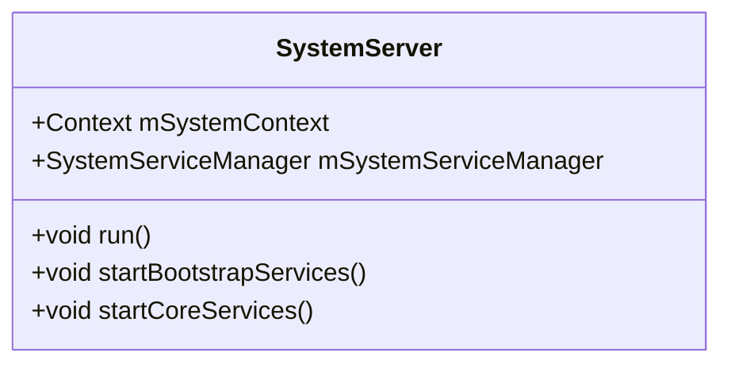

# AOSP Code Analyzer

A comprehensive module for fetching, parsing, and generating diagrams from actual Android Open Source Project (AOSP) source code.

## Overview

The AOSP Code Analyzer allows you to:
- **Fetch** actual source code from AOSP `android-16.0.0_r3`
- **Parse** Java files to extract class structures, methods, and fields
- **Generate** class diagrams automatically from real code
- **Generate** sequence diagrams for method execution flows
- **Extract** code blocks with proper context and line numbers
- **Cache** fetched source code to avoid repeated network requests

## Installation

No additional dependencies required. Uses Node.js built-in modules (`https`, `fs`, `path`).

## Usage

### Command Line Interface

#### Fetch Source Code

```bash
node tools/aosp-code-analyzer.js fetch frameworks/base/services/java/com/android/server/SystemServer.java
```

This fetches the source code and caches it locally (24-hour cache).

#### Parse Java File

```bash
node tools/aosp-code-analyzer.js parse frameworks/base/services/java/com/android/server/SystemServer.java
```

Outputs JSON structure with:
- Package declaration
- Imports
- Classes, interfaces, enums
- Methods with parameters
- Fields with types
- Inheritance relationships

#### Generate Class Diagram

```bash
# Generate diagram for all classes in file
node tools/aosp-code-analyzer.js class-diagram frameworks/base/services/java/com/android/server/SystemServer.java

# Generate diagram for specific class
node tools/aosp-code-analyzer.js class-diagram frameworks/base/services/java/com/android/server/SystemServer.java SystemServer
```

Generates a Mermaid class diagram that can be embedded directly in Markdown.

#### Generate Sequence Diagram

```bash
node tools/aosp-code-analyzer.js sequence-diagram frameworks/base/services/java/com/android/server/SystemServer.java run
```

Generates a Mermaid sequence diagram showing method calls within the specified method.

#### Extract Code Block

```bash
# Extract lines 100-150 with 5 lines of context (default)
node tools/aosp-code-analyzer.js code-block frameworks/base/services/java/com/android/server/SystemServer.java 100 150

# Extract with custom context
node tools/aosp-code-analyzer.js code-block frameworks/base/services/java/com/android/server/SystemServer.java 100 150 10
```

#### Clear Cache

```bash
node tools/aosp-code-analyzer.js clear-cache
```

## Integration with Articles

### Using AOSP Directives in Markdown

You can embed AOSP-generated content directly in your article Markdown files using special HTML comments:

#### Class Diagram Directive

```markdown
<!-- AOSP_CLASS_DIAGRAM: frameworks/base/services/java/com/android/server/SystemServer.java SystemServer -->
```

This will be replaced with a Mermaid class diagram when you run:

```bash
node tools/aosp-integration.js process
```

#### Sequence Diagram Directive

```markdown
<!-- AOSP_SEQUENCE_DIAGRAM: frameworks/base/services/java/com/android/server/SystemServer.java run -->
```

#### Code Block Directive

```markdown
<!-- AOSP_CODE_BLOCK: frameworks/base/services/java/com/android/server/SystemServer.java 100 150 5 -->
```

Parameters:
- `filePath`: AOSP file path (relative to platform/)
- `startLine`: Starting line number
- `endLine`: Ending line number
- `contextLines`: (Optional) Number of context lines before/after (default: 5)

### Processing All Articles

To process all articles and replace AOSP directives:

```bash
node tools/aosp-integration.js process
```

This will:
1. Scan all `.md` files in `content/articles/`
2. Find AOSP directives
3. Fetch source code from AOSP
4. Generate diagrams/code blocks
5. Replace directives with generated content
6. Add source links automatically

## Programmatic API

### Import the Module

```javascript
const aospAnalyzer = require('./tools/aosp-code-analyzer');
const aospIntegration = require('./tools/aosp-integration');
```

### Fetch Source Code

```javascript
const code = await aospAnalyzer.fetchSourceCode('frameworks/base/services/java/com/android/server/SystemServer.java');
console.log(code);
```

### Parse Java Class

```javascript
const code = await aospAnalyzer.fetchSourceCode('frameworks/base/services/java/com/android/server/SystemServer.java');
const parsed = aospAnalyzer.parseJavaClass(code);
console.log(parsed.classes);
console.log(parsed.methods);
```

### Generate Class Diagram

```javascript
const code = await aospAnalyzer.fetchSourceCode('frameworks/base/services/java/com/android/server/SystemServer.java');
const parsed = aospAnalyzer.parseJavaClass(code);
const diagram = aospAnalyzer.generateClassDiagram(parsed, 'SystemServer');
console.log(diagram); // Mermaid diagram code
```

### Generate Sequence Diagram

```javascript
const code = await aospAnalyzer.fetchSourceCode('frameworks/base/services/java/com/android/server/SystemServer.java');
const parsed = aospAnalyzer.parseJavaClass(code);
const diagram = aospAnalyzer.generateSequenceDiagram(code, 'run', parsed);
console.log(diagram); // Mermaid sequence diagram
```

### Extract Code Block

```javascript
const code = await aospAnalyzer.fetchSourceCode('frameworks/base/services/java/com/android/server/SystemServer.java');
const block = aospAnalyzer.extractCodeBlock(code, 100, 150, 5);
console.log(block.code); // Code with context
console.log(block.startLine); // First line number
console.log(block.endLine); // Last line number
```

## Integration Helpers

### Generate Class Diagram with Source Link

```javascript
const diagram = await aospIntegration.generateClassDiagramFromAOSP(
  'frameworks/base/services/java/com/android/server/SystemServer.java',
  'SystemServer',
  { includeSourceLink: true }
);
```

### Process Markdown with Directives

```javascript
const markdown = fs.readFileSync('article.md', 'utf8');
const processed = await aospIntegration.processAOSPDirectives(markdown);
fs.writeFileSync('article.md', processed, 'utf8');
```

## File Path Format

AOSP file paths should be relative to the `platform/` directory:

**Correct:**
- `frameworks/base/services/java/com/android/server/SystemServer.java`
- `packages/apps/Settings/src/com/android/settings/SettingsActivity.java`
- `system/core/libutils/RefBase.cpp`

**Incorrect:**
- `/frameworks/base/...` (leading slash)
- `platform/frameworks/base/...` (includes platform/)
- `https://android.googlesource.com/...` (full URL)

## Caching

Source code is cached in `.aosp-cache/` directory:
- Cache duration: 24 hours
- Cache key: File path (sanitized)
- Cache format: Plain text Java source

To clear cache:
```bash
node tools/aosp-code-analyzer.js clear-cache
```

## Limitations

1. **Java Parsing**: Uses regex-based parsing, may not handle all edge cases
2. **Sequence Diagrams**: Simple heuristic-based method call detection
3. **Large Files**: Very large files may take time to parse
4. **Network**: Requires internet connection to fetch source code
5. **Rate Limiting**: AOSP may rate-limit requests if too frequent

## Examples

### Example 1: Generate Class Diagram for SystemServer

```bash
node tools/aosp-code-analyzer.js class-diagram frameworks/base/services/java/com/android/server/SystemServer.java SystemServer
```

Output:


### Example 2: Extract SystemServer.run() Method

```bash
node tools/aosp-code-analyzer.js code-block frameworks/base/services/java/com/android/server/SystemServer.java 100 150
```

### Example 3: Use in Article

Add to your Markdown file:

```markdown
## SystemServer Architecture

<!-- AOSP_CLASS_DIAGRAM: frameworks/base/services/java/com/android/server/SystemServer.java SystemServer -->

The SystemServer class is responsible for...

<!-- AOSP_CODE_BLOCK: frameworks/base/services/java/com/android/server/SystemServer.java 100 150 5 -->
```

Then process:
```bash
node tools/aosp-integration.js process
```

## Troubleshooting

### "HTTP 404" Error
- Check file path format (should be relative to platform/)
- Verify file exists in android-16.0.0_r3 tag
- Check AOSP source URL manually

### "Failed to decode source"
- AOSP may have changed response format
- Try clearing cache: `node tools/aosp-code-analyzer.js clear-cache`

### "No class diagram could be generated"
- File may not contain classes
- Class name may not match
- Check parsed structure: `node tools/aosp-code-analyzer.js parse <filePath>`

### Network Timeout
- Check internet connection
- AOSP servers may be slow
- Try again later

## Future Enhancements

- [ ] Support for Kotlin files
- [ ] Support for C/C++ files
- [ ] More sophisticated Java parsing (AST-based)
- [ ] Better sequence diagram generation (control flow analysis)
- [ ] Support for multiple Android versions
- [ ] Batch processing for multiple files
- [ ] Integration with build.js for automatic processing

## References

- [AOSP Source Browser](https://android.googlesource.com/)
- [Mermaid Diagram Syntax](https://mermaid.js.org/)
- [Android 16.0.0_r3 Tag](https://android.googlesource.com/platform/frameworks/base/+/refs/tags/android-16.0.0_r3)


