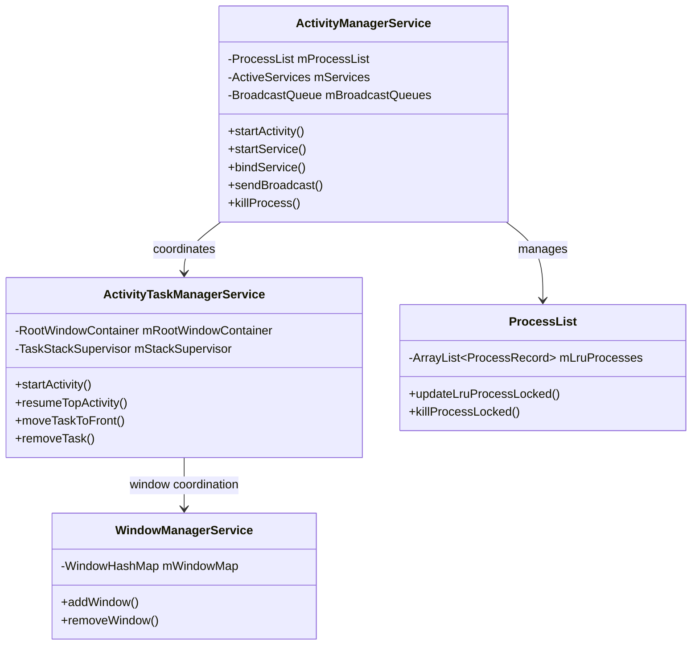
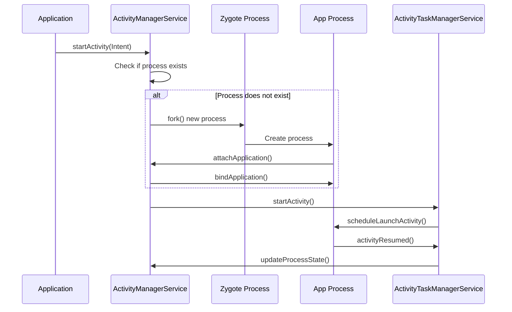
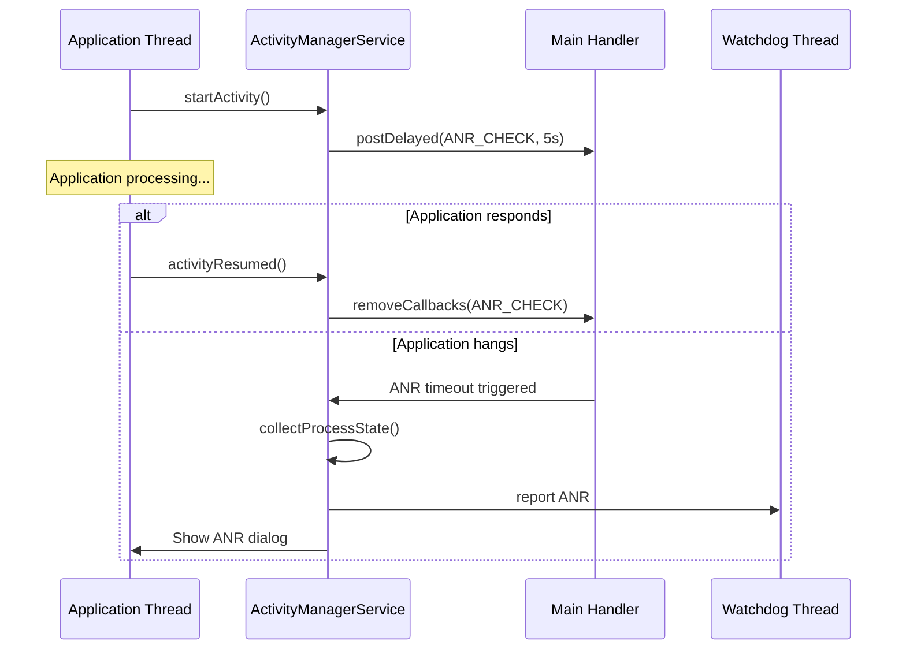
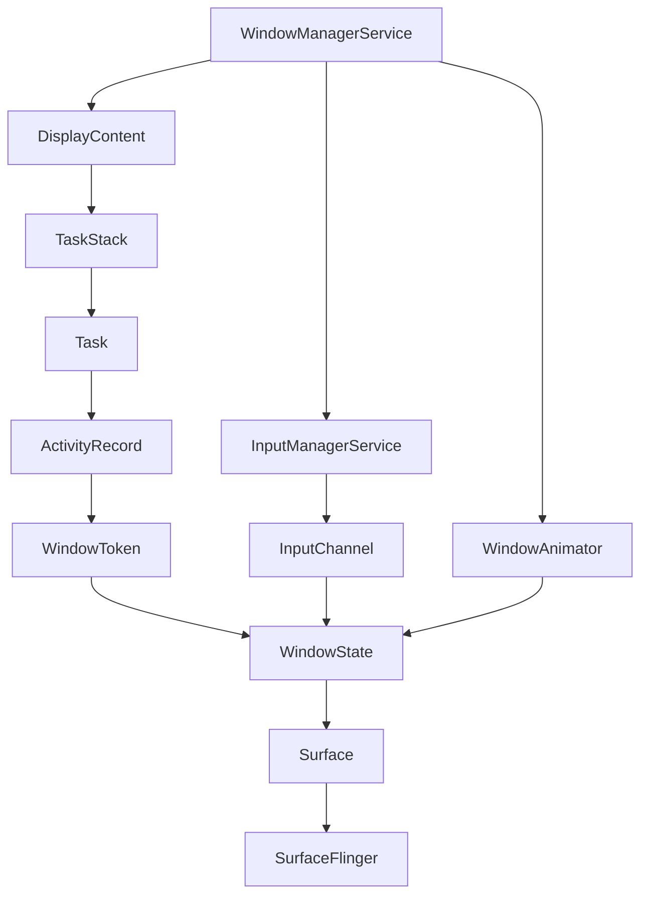
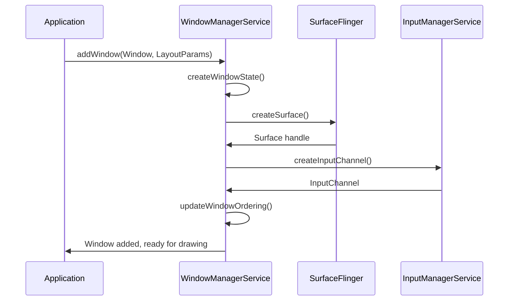
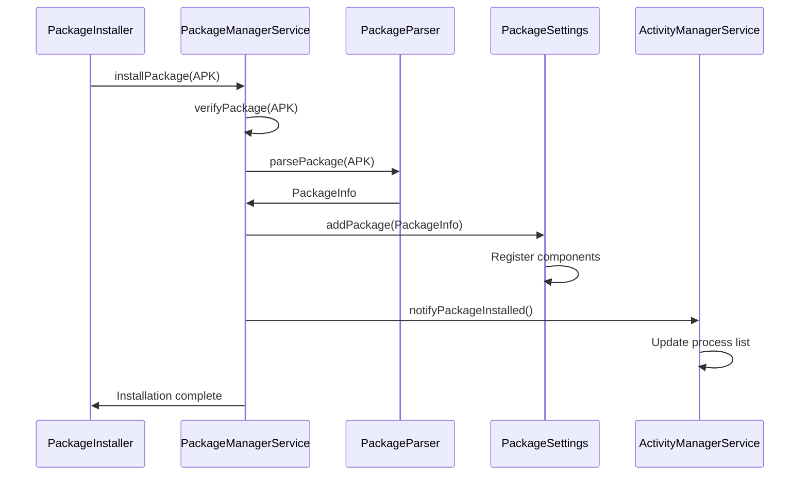
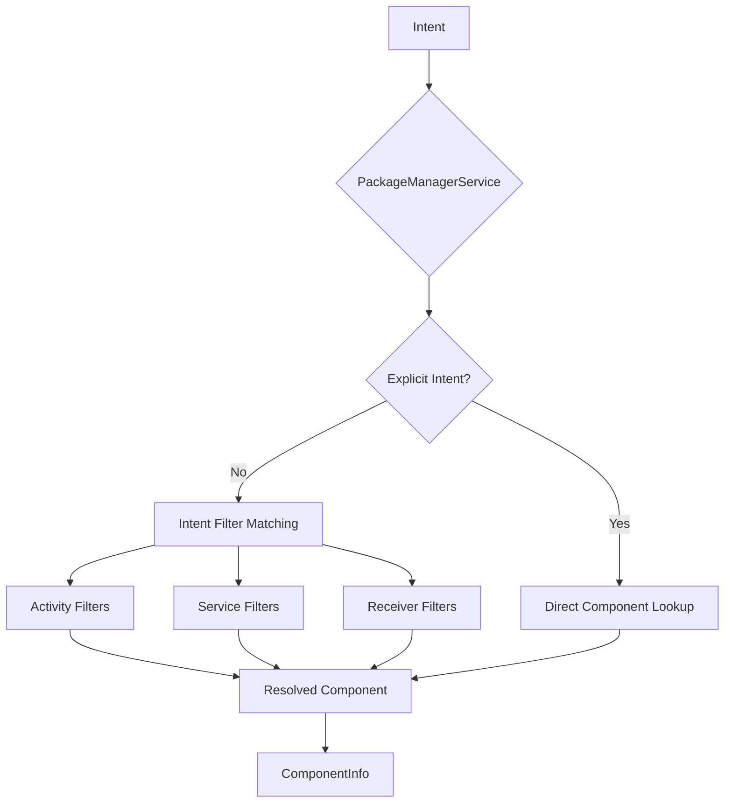
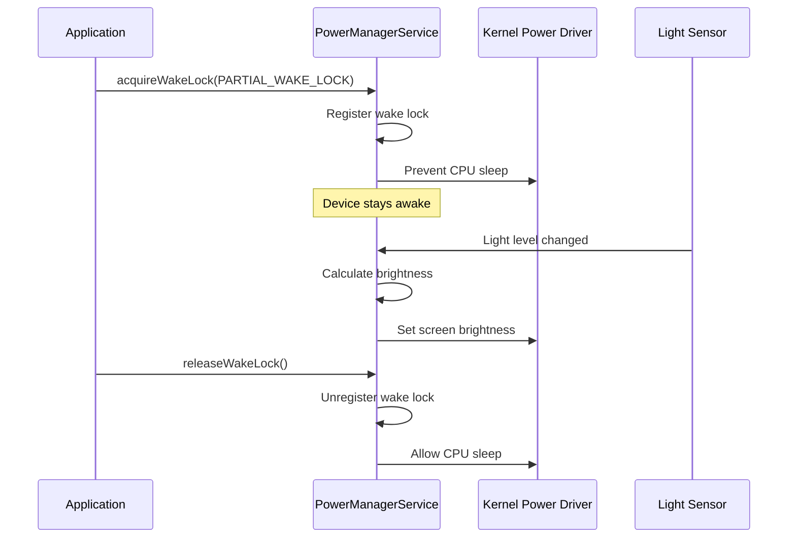
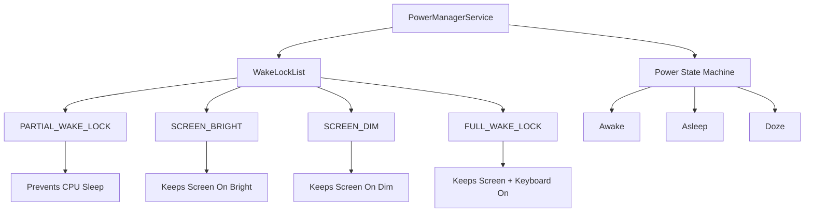

# System Server: Core System Services

> **Part 2 of 6** in the [Android System Server Deep Dive](./android-system-server-series.html) series
> 
> **Previous**: [Part 1: Architecture and Design](./android-system-server-architecture.html)  
> **Next**: [Part 3: Binder IPC Framework](./android-system-server-binder-ipc.html)  
> **Series Index**: [View all articles](./android-system-server-series.html)

## Learning Objectives

By the end of this article, you will understand:
- The role and responsibilities of each core system service
- How ActivityManagerService and ActivityTaskManagerService coordinate
- WindowManagerService's window and surface management
- PackageManagerService's package lifecycle management
- PowerManagerService's power and thermal management

---

## Part II: Core System Services

### 2.1 ActivityManagerService (AMS) and ActivityTaskManagerService (ATMS)

**Modern Architecture Split (Android 10+):**

The traditional ActivityManagerService was split into two services to improve modularity and maintainability:

- **ActivityTaskManagerService (ATMS)**: Handles UI-related concerns including Activity lifecycle, task management, task stack navigation, intent resolution for Activities, and window management coordination.
- **ActivityManagerService (AMS)**: Manages application processes, background services lifecycle, system broadcasts, content providers, and process scheduling.

**Why the Split?**
- **Separation of Concerns**: UI logic separated from process management
- **Maintainability**: Smaller, focused codebases
- **Testing**: Easier to test UI logic independently
- **Performance**: Reduced coupling allows for better optimization

**Key Responsibilities:**

**ActivityManagerService (AMS):**
- **Process Lifecycle Management**: Creates, manages, and destroys application processes
- **Process Scheduling**: Determines which processes to keep alive based on importance
- **Background Service Management**: Manages started services, bound services, and foreground services
- **Broadcast Management**: Handles system broadcasts and ordered broadcast delivery
- **Content Provider Management**: Manages content provider lifecycle and access
- **ANR Detection**: Monitors application responsiveness and triggers ANR dialogs

**ActivityTaskManagerService (ATMS):**
- **Activity Lifecycle**: Orchestrates Activity state transitions (onCreate, onStart, onResume, etc.)
- **Task Management**: Manages task stacks, recent tasks, and task navigation
- **Intent Resolution**: Resolves implicit intents to specific Activity components
- **Activity Stack**: Maintains back stack and handles task switching
- **Multi-Window Support**: Coordinates split-screen, freeform, and picture-in-picture modes

**Service Interaction Diagram:**

**Process Lifecycle Flow:**

**ANR Detection Mechanism:**

### 2.2 WindowManagerService (WMS)

**Core Functions:**

**Window Management:**
- **Z-Ordering**: Maintains window layering (wallpaper, application windows, system windows, overlay windows)
- **Window Lifecycle**: Manages window creation, resizing, visibility, and destruction
- **Window Types**: Handles different window types (application, system, overlay, toast, etc.)
- **Window Attributes**: Manages window flags, layout parameters, and display configuration

**Surface Management:**
- **SurfaceFlinger Integration**: Creates and manages Surface objects that SurfaceFlinger composites
- **Surface Allocation**: Allocates and deallocates graphic buffers for windows
- **Composition**: Coordinates with SurfaceFlinger for screen composition
- **Buffer Management**: Manages buffer queues and swap chains

**Input Event Dispatching:**
- **Input Channel Management**: Creates input channels for windows to receive touch/key events
- **Event Routing**: Routes input events to the correct window based on touch coordinates
- **Focus Management**: Tracks which window has input focus
- **Input Method Coordination**: Coordinates with InputMethodService for soft keyboard

**Screen Transitions and Animations:**
- **Window Animations**: Manages window transition animations (open, close, minimize)
- **Activity Transitions**: Coordinates Activity transition animations with ATMS
- **Screen Rotation**: Handles display rotation and window reconfiguration
- **Multi-Display Support**: Manages windows across multiple displays

**Window Hierarchy:**

**Window Addition Flow:**

### 2.3 PackageManagerService (PMS)

**Responsibilities:**

**Package Lifecycle Management:**
- **Installation**: Handles APK installation, including verification, parsing, and component registration
- **Uninstallation**: Removes packages and cleans up associated data
- **Updates**: Manages package updates, including version checks and data migration
- **Package Scanning**: Scans installed packages on boot and during runtime

**Component Registration:**
- **AndroidManifest.xml Parsing**: Parses manifest files to extract components (Activities, Services, Receivers, Providers)
- **Component Database**: Maintains a database of all registered components
- **Intent Filter Matching**: Supports Intent resolution by matching intent filters
- **Component State**: Tracks enabled/disabled state of components

**Permission Management:**
- **Permission Definition**: Parses and stores permission definitions from manifests
- **Permission Grants**: Manages runtime permission grants (Android 6.0+)
- **Permission Checks**: Validates permission requirements for component access
- **Signature Permissions**: Handles signature-based permission validation

**Package Data Management:**
- **Application Data**: Manages application data directories (`/data/data/<package>`)
- **Code Paths**: Tracks APK and library paths for each package
- **Shared Libraries**: Manages shared library dependencies
- **Package Signatures**: Validates and stores package signatures

**Package Installation Flow:**

**Component Resolution:**

### 2.4 PowerManagerService

**Key Features:**

**Power State Management:**
- **Device Power States**: Manages device sleep, wake, and doze states
- **Screen States**: Controls screen on/off, dimming, and brightness levels
- **CPU Power States**: Coordinates CPU frequency scaling and core management
- **Power State Transitions**: Handles state transitions with proper sequencing

**Wake Lock Management:**
- **Wake Lock Types**: Manages different wake lock types (PARTIAL_WAKE_LOCK, SCREEN_BRIGHT, etc.)
- **Wake Lock Lifecycle**: Tracks wake lock acquisition and release
- **Timeout Handling**: Enforces wake lock timeouts to prevent battery drain
- **Wake Lock Statistics**: Maintains statistics for debugging power issues

**Screen and Brightness Control:**
- **Brightness Levels**: Manages screen brightness from 0-255
- **Auto-Brightness**: Coordinates with light sensor for adaptive brightness
- **Screen Timeout**: Handles screen timeout based on user activity
- **Display Power State**: Controls display power modes (on, doze, off)

**Thermal Management:**
- **Thermal Zones**: Monitors device temperature from thermal sensors
- **Throttling**: Implements CPU/GPU throttling when temperature exceeds thresholds
- **Thermal States**: Manages thermal states (normal, warning, critical, emergency)
- **Cooling Actions**: Triggers cooling actions (reducing performance, disabling features)

**Power Saving Modes:**
- **Battery Saver Mode**: Implements battery saver restrictions (background restrictions, reduced performance)
- **Doze Mode**: Manages doze mode for deep sleep optimization
- **App Standby**: Manages app standby buckets for background optimization
- **Adaptive Battery**: Coordinates with machine learning for predictive power management

**Power Management Flow:**

**Wake Lock Hierarchy:**

---

## Summary

In this article, we've explored the core system services:

1. **ActivityManagerService & ActivityTaskManagerService**: Process and Activity lifecycle management
2. **WindowManagerService**: Window, surface, and input event management
3. **PackageManagerService**: Package installation, component registration, and permission management
4. **PowerManagerService**: Power states, wake locks, thermal management, and power optimization

Each service plays a critical role in Android's operation, and understanding their interactions is key to mastering system_server.

---

## Next Steps

Continue to **[Part 3: Binder IPC Framework](./android-system-server-binder-ipc.html)** to learn how these services communicate with application processes and each other through the Binder IPC mechanism.

---

## Related Articles

- [Part 1: Architecture and Design](./android-system-server-architecture.html)
- [Part 3: Binder IPC Framework](./android-system-server-binder-ipc.html)
- [Part 4: Debugging and Troubleshooting](./android-system-server-debugging.html)
- [Series Index](./android-system-server-series.html)

---

*This article is part of the [Android System Server Deep Dive](./android-system-server-series.html) series. For the complete learning path, start with the [Series Index](./android-system-server-series.html).*

