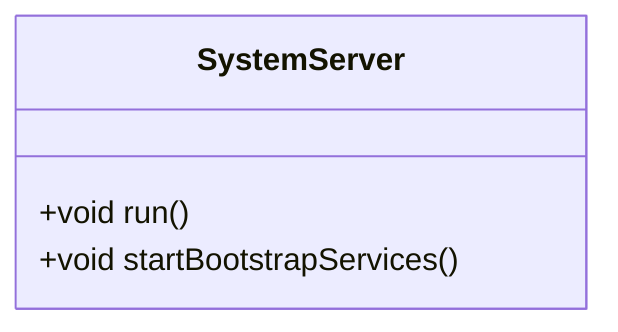
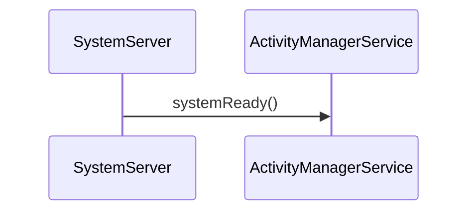

# AOSP Code Analyzer - Example Usage

## Example: Adding SystemServer Class Diagram to Article

### Before (Manual)

You would manually write:

```markdown
## SystemServer Architecture



**Source:** [SystemServer.java](https://android.googlesource.com/platform/frameworks/base/+/refs/tags/android-16.0.0_r3/services/java/com/android/server/SystemServer.java)
```

### After (Using AOSP Analyzer)

Simply add a directive:

```markdown
## SystemServer Architecture

<!-- AOSP_CLASS_DIAGRAM: frameworks/base/services/java/com/android/server/SystemServer.java SystemServer -->
```

Then run:
```bash
node tools/aosp-integration.js process
```

The directive is automatically replaced with:
- Complete class diagram from actual AOSP source
- All methods and fields automatically detected
- Source link automatically added
- Always up-to-date with android-16.0.0_r3

## Example: Extracting Code Block

### Before (Manual Copy-Paste)

```markdown
```java
private void run() {
    mSystemContext = ActivityThread.systemMain().getSystemContext();
    // ... manually copied code ...
}
```

**Source:** [SystemServer.java:100-150](https://...)
```

### After (Using AOSP Analyzer)

```markdown
<!-- AOSP_CODE_BLOCK: frameworks/base/services/java/com/android/server/SystemServer.java 100 150 5 -->
```

Automatically:
- Fetches exact code from AOSP
- Includes 5 lines of context before/after
- Adds proper source link with line numbers
- Always matches actual source

## Example: Sequence Diagram

### Before (Manual)

```markdown

```

### After (Using AOSP Analyzer)

```markdown
<!-- AOSP_SEQUENCE_DIAGRAM: frameworks/base/services/java/com/android/server/SystemServer.java run -->
```

Automatically:
- Analyzes actual `run()` method code
- Detects all method calls
- Generates sequence diagram
- Adds source link

## Complete Article Example

```markdown
---
title: "Android System Server Deep Dive"
date: "2025-01-15"
---

# Android System Server

## Architecture Overview

<!-- AOSP_CLASS_DIAGRAM: frameworks/base/services/java/com/android/server/SystemServer.java SystemServer -->

The SystemServer is the core of Android's system services...

## Entry Point

The `run()` method is the entry point:

<!-- AOSP_CODE_BLOCK: frameworks/base/services/java/com/android/server/SystemServer.java 100 150 5 -->

## Execution Flow

Here's how the system initializes:

<!-- AOSP_SEQUENCE_DIAGRAM: frameworks/base/services/java/com/android/server/SystemServer.java run -->
```

## Workflow

1. **Write Article** with AOSP directives
2. **Process Articles**: `node tools/aosp-integration.js process`
3. **Review Generated Content**: Check that diagrams/code look correct
4. **Build Site**: `node tools/build.js`
5. **Deploy**: Your articles now have accurate, up-to-date AOSP content!

## Benefits

✅ **Accuracy**: Always matches actual AOSP source code  
✅ **Maintainability**: Regenerate when AOSP changes  
✅ **Efficiency**: No manual copy-paste or diagram drawing  
✅ **Consistency**: All diagrams follow same format  
✅ **Source Links**: Automatically added to all generated content  


